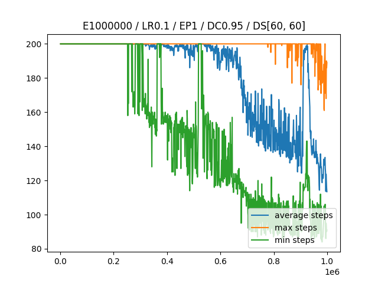

# Drei verschiedene Varianten zum Spielen von "Mountain Car"

Dieses Repository enthält drei verschiedene Spielvarianten der "[Mountain Car](https://gymnasium.farama.org/environments/classic_control/mountain_car/)" Umgebung aus dem Python Modul "[Gymnasium](https://pypi.org/project/gymnasium/)".

### 1. Manuelle Steuerung
In dem ersten Programmcode [`gym_mountain_car_manual.py`](MountainCar/gym_mountain_car_manual.py) findet man die Version des Spiels, bei welcher man das Auto selbst steuern kann. Dies tut man mit den Pfeiltasten **Links** und **Rechts**.

### 2. Regelbasierter Algorithmus
In dem zweiten Programmcode [`gym_mountain_car_rules.py`](MountainCar/gym_mountain_car_rules.py) findet man die Version des Spiels, bei welcher das Auto anhand von zuvor festgelegten Regeln selbst fahren kann. Zudem hat dieses Programm kein Lern-Algorithmus integriert und somit ist der erste Versuch nahezu gleich, wie der Letzte.

Regeln:

  - wenn Geschwindigkeit unter null, führt Agent Aktion **links** aus
  - wenn Geschwindigkeit über null, führt Agent Aktion **rechts** aus
  - wenn Geschwindigkeit null, führt Agent Aktion **nichts tun** aus
    
### 3. Q-Learning Algorithmus (mit Q-Tabellen)
In dem letzten Programmcode [`gym_mountain_car_q_table_learn.py`](MountainCar/gym_mountain_car_q_table_learn.py) findet man die Version des Spiels, bei welcher mithilfe von Reinforcement Learning das System über ein Training selbst lernt das Auto möglichst gut zu steuern. Hierbei kommt eine Q-Tabelle zum Einsatz, welche über ein Belohnungssystem die besten Aktionen abhänging vom aktuellen Zustand bestimmt.

Beispiel-Lernkurve für das Training mit folgenden Parametern:

| Parameter | Wert |
|-----------|------|
| Episoden | 1.000.000 |
| diskrete Positionen | 60 |
| Start Epsilon | 1 |
| Ende Epsilon | 0 |
| Lernrate | 0,1 |
| Verzögerungsrate | 0,95 |

  

### 4. Quellen
- https://pythonprogramming.net/q-learning-reinforcement-learning-python-tutorial/
- https://gymnasium.farama.org/environments/classic_control/mountain_car/
